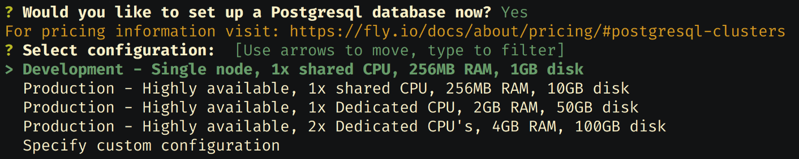
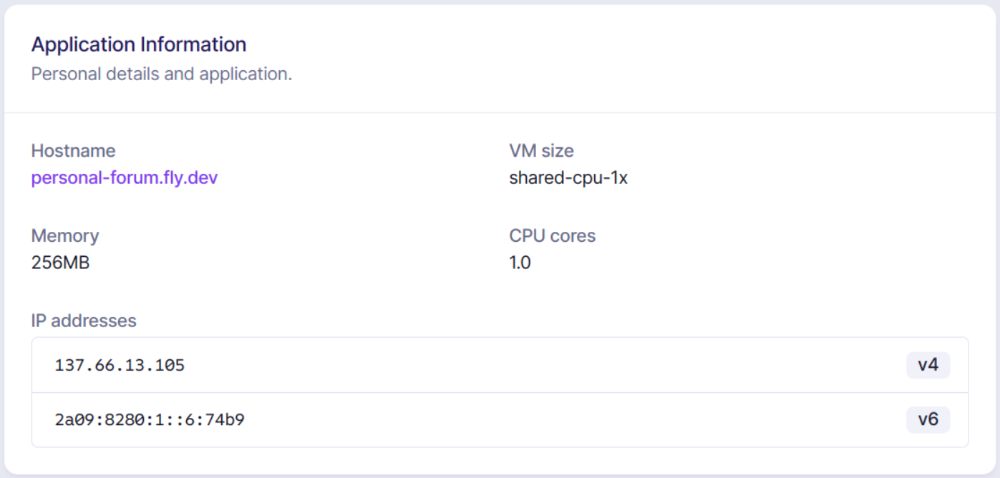

# How to deploy the application to Fly.io

> **Note**: This guide should be accurate as of September 2022.

This is a step-by-step guide for deploying the web app to Fly.io, similar to the
[demo page](https://personal-forum.fly.dev).

If you notice any mistakes, feel free to open an issue.

 **Important**: Even though we only use free resources offered by the website,
this guide still requires adding a form of payment information to your account.

## Clone the repository

First, clone the repo to a directory of your liking and `cd` into it.

I recommend creating a new branch for deployment, in case you decide to commit a
few files which we don't normally track.

For example:

```bash
# Clone the repo.
git clone https://github.com/pandrei7/personal_forum.git YOUR_DIR
cd YOUR_DIR

# Create a new branch.
git switch -c deploy
```

## Set up the Dockerfile

Fly.io does not support Rust projects directly, but we can deploy any app if we
provide a Dockerfile.

Simply copy the code below in a file named `Dockerfile`:

```dockerfile
# Build the application.
FROM rust:latest AS builder

WORKDIR /app
COPY . .

RUN --mount=type=cache,target=/app/target \
    --mount=type=cache,target=/usr/local/cargo/registry \
    --mount=type=cache,target=/usr/local/cargo/git \
    --mount=type=cache,target=/usr/local/rustup \
    set -eux; \
    rustup install stable; \
    cargo build --release; \
    objcopy --compress-debug-sections target/release/personal_forum ./personal_forum

################################################################################

# Copy the binary and other resources needed to run the server.
FROM debian:stable-slim

WORKDIR app

COPY --from=builder /app/personal_forum ./personal_forum
COPY static static
COPY templates templates
COPY Rocket.toml Rocket.toml

CMD ROCKET_PROFILE=release ROCKET_DATABASES={db={url=${DATABASE_URL}}} ./personal_forum
```

You should also create a `.dockerignore` file with the following contents:

```docker
/target
```

## Configure the application for release mode

Rocket requires us to set a secret key for encryption when we run the app in
release mode. You can generate a key using the command below.

```bash
openssl rand -base64 32
```

Create a file named `Rocket.toml` if you don't already have one and add the
following settings to it. Copy the secret key generated earlier inside.

```toml
[release]
secret_key = "YOUR_SECRET_KEY"
address = "0.0.0.0"
port = 8080
```

You do not *have* to use port 8080 if you don't want to, but make sure the port
you use is the same as in Fly.io's configuration file (created later).

## Set up the Fly.io application

### Create an account and install `flyctl`

First, you should make sure you have a Fly.io account and you have added a
credit card to it (this is required for the free tier).

Then, you should [install `flyctl`](https://fly.io/docs/flyctl/installing) and
log in to your account with [`flyctl auth login`](
https://fly.io/docs/flyctl/auth-login).

### Create a new app

To create a new app, run [`flyctl launch`](https://fly.io/docs/flyctl/launch).

The utility should detect a Dockerfile app and prompt you for some settings.
Choose a name and region you prefer. When prompted if you want to set up a
PostgreSQL database now, choose `Yes` and select the `Development` configuration,
as you can see below.



This will actually create two applications: one for the web application and a
separate one for the database.

When prompted if you want to deploy the application now, choose `No`.

### Check the app configuration

You should now have a `fly.toml` file in your directory.

Before you deploy the application, check that the settings in `fly.toml`  are
appropriate. The defaults should be good, but make sure the `internal_port` is
the same as the one you used in `Rocket.toml`.

For reference, the settings below should work:

```toml
# fly.toml
app = "YOUR_APP_NAME"
kill_signal = "SIGINT"
kill_timeout = 5
processes = []

[env]

[experimental]
  allowed_public_ports = []
  auto_rollback = true

[[services]]
  http_checks = []
  internal_port = 8080
  processes = ["app"]
  protocol = "tcp"
  script_checks = []
  [services.concurrency]
    hard_limit = 25
    soft_limit = 20
    type = "connections"

  [[services.ports]]
    force_https = true
    handlers = ["http"]
    port = 80

  [[services.ports]]
    handlers = ["tls", "http"]
    port = 443

  [[services.tcp_checks]]
    grace_period = "1s"
    interval = "15s"
    restart_limit = 0
    timeout = "2s"
```

## Deploy the app

When you are ready to deploy the application, run [`flyctl deploy`](
https://fly.io/docs/flyctl/deploy). This will probably take a few minutes the
first time you do it. If you ever make changes to the code and want to redeploy,
simply run `flyctl deploy` again.

If the application deployed successfully, try to access it. You can do this
either by running [`flyctl open`](https://fly.io/docs/flyctl/open) or by
visiting the URL directly. You can find the URL on Fly.io's website, by clicking
on your application and looking for the `hostname` field, as seen below.



The website should look like this:


## Add an administrator

To control the server, you have to log into the admin pane using admin
credentials. These credentials are held in the database and can only be modified
manually. Follow the next steps to add an administrator account.

### Choose the credentials

First, choose a username and a password. Then, copy the SHA-256 hash of your
password:

```bash
# Obtain your password hash.
echo -n 'YOUR_PASSWORD' | sha256sum
```

### Connect to the database

You can connect to the database using [`flyctl postgres connect`](
https://fly.io/docs/flyctl/postgres-connect).

Run `flyctl postgres connect -a YOUR_DB_APP` using the name of your **database**
application to open a [psql](http://postgresguide.com/utilities/psql.html)
shell.

Choose the right database and insert your credentials in the `admins` table:

```sql
-- List all databases and find the correct one.
\l
-- Change to your database.
\c YOUR_DB_NAME

-- Insert the new admin.
insert into admins (username, password) values ('YOUR_USERNAME', 'YOUR_HASH');

-- Quit the psql shell.
\q
```

You should now be able to log in by accessing the `/admin_login` path.

## Next steps

The deployment is now complete. You probably want to create some rooms and add a
welcome message, which can be done from the admin pane. If you want to create a
demo page, you should display the credentials for open rooms in the welcome
message, so visitors can see them. Don't forget that you can type HTML code for
the message.


